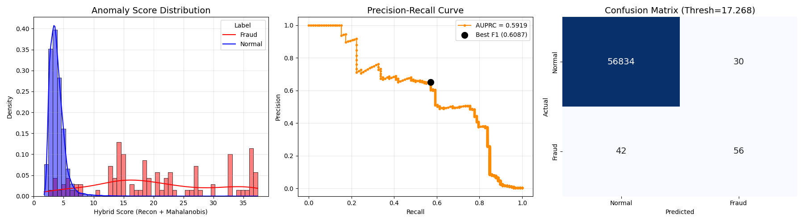

# 이상 탐지 프로젝트 (Anomaly Detection)

본 프로젝트는 트랜스포머 기반의 VAE(Transformer VAE)와 대조 학습(Contrastive Learning)을 활용하여 신용카드 사기(Credit Fraud)를 탐지하는 모델을 구현합니다. 이상 점수 산출에는 복원 오차(Reconstruction Error)와 마할라노비스 거리(Mahalanobis Distance)를 결합한 하이브리드 점수(Hybrid Score) 방식을 사용합니다.

## 프로젝트 구조 (Project Structure)

- `main.py`: 모델 학습 및 하이브리드 점수 기반 평가를 수행하는 메인 스크립트입니다.
- `dataset.py`: 데이터 로드 및 전처리를 담당합니다 (마스킹 증강 기법 적용).
- `model.py`: Transformer VAE 모델 아키텍처 및 손실 함수가 정의되어 있습니다.
- `visualize.py`: 학습된 모델을 불러와 성능 지표를 시각화하고 결과를 저장합니다.
- `iForest.py`: 베이스라인 모델인 Isolation Forest 구현체입니다.
- `DataLoader.py`: 원본 데이터셋을 다운로드하고 기본 전처리를 수행합니다.

## 요구 사항 (Requirements)

다음과 같은 Python 패키지가 필요합니다:

- `torch`
- `numpy`
- `pandas`
- `scikit-learn`
- `tqdm`
- `torch_geometric`
- `requests`
- `torchvision`

설치는 다음 명령어를 통해 가능합니다:
```bash
pip install -r requirements.txt
```

## 사용 방법 (Usage)

### 1. 하이브리드 모델 학습 및 평가

Transformer VAE 모델을 학습하고 평가하려면 다음 명령어를 실행하세요.

```bash
python main.py
```

이 스크립트는 다음 과정을 수행합니다:
1.  신용카드 사기 데이터셋 로드 및 전처리 (Masking Augmentation 적용).
2.  Transformer VAE 모델 학습.
3.  정상 데이터의 잠재 공간(Latent Space) 중심 및 공분산 계산.
4.  하이브리드 점수(복원 오차 + 마할라노비스 거리)를 통한 이상 탐지 평가.
5.  최적의 모델을 `model/best_model.pth`에 저장.

### 2. 시각화 및 결과 분석

학습 완료 후, 다음 명령어로 성능 지표를 시각화할 수 있습니다.

```bash
python visualize.py
```

결과 이미지는 `image/` 디렉터리에 저장됩니다.

## 성능 시각화 (Performance Visualization)

`visualize.py` 실행 시 생성되는 주요 그래프입니다.



위 그래프는 다음 세 가지를 보여줍니다:
1.  **이상 점수 분포 (Anomaly Score Distribution)**: 정상 데이터(파란색)와 사기 데이터(빨간색)의 점수 분포 차이를 보여줍니다. 두 분포가 잘 분리될수록 성능이 우수함을 의미합니다.
2.  **PR 곡선 (Precision-Recall Curve)**: 불균형 데이터셋에서 중요한 AUPRC와 최적 F1 Score 지점을 나타냅니다.
3.  **혼동 행렬 (Confusion Matrix)**: 최적의 임계값(Threshold)을 기준으로 분류했을 때의 정답 및 오답 개수를 보여줍니다.
